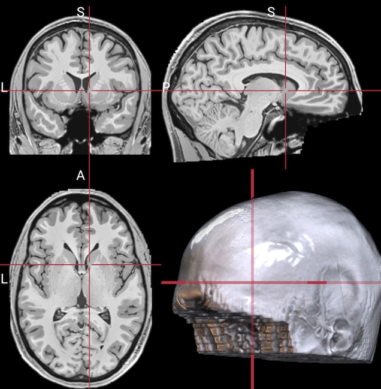

# nii_deface

Defacing removes facial features from MRI scans to protect participant identity.  
This script masks facial structures and crops away non-brain signal to reduce the field of view.



---

## Installation

This script requires Python 3.9+ and the following packages:

- [ANTsPy](https://github.com/ANTsX/ANTsPy)
- [nibabel](https://github.com/nipy/nibabel)

Install them with:

```bash
pip install -r requirements.txt
```

## Usage

Run the script on a 3D NIfTI image (.nii or .nii.gz):

```bash
python nii_deface.py FLAIR.nii.gz
```

The masked and cropped image overwrites the original file.

While robust, automated defacing is destructive—always visually inspect results.

##  Limitations

The ANTs-based method can be slower than affine-only tools but is generally more robust. External features (nose, ears, scalp fat, neck) are removed by design. This improves privacy and can reduce ghosting artifacts. However, some segmentation tools (e.g. older SPM pipelines) that use air intensity to estimate noise may behave differently when zeros are introduced.

## Alternatives

Two alternatives are provided with this repository. Both are provided for historical reasons, and are outperformed by the ANTS-based script.

The `mydeface.py` script uses FSL's [FLIRT](https://fsl.fmrib.ox.ac.uk/fsl/fslwiki/FLIRT). This is a defacing utility for MRI images that was inspired by [pydeface](https://github.com/poldracklab/pydeface). It differs differs in a minor ways:
  - The `normmi` normalized mutual information cost function is a bit more robust.
  - While pydeface strips regions around the nose and eyes, mydeface expands this and strips all signal outside a narrowly defined scalp. This influences recognition of ear shape. Further, as excess neck and scalp fat are removed this can aid subsequent analyses. Further, ghosting images of facial features are removed from the air. However, since all these external features are set to zero, this can impact some segmentation tools that use the variability in the air signal to estimate noise variance (e.g. Gaussian mixture models for earlier versions of SPM). Likewise, this may impact the performance of homogeneity biased intensity correction. Tools should use implicit zero masking.

FSL's FLIRT uses the center of brightness as its starting estimate. Therefore, it can be disrupted by too much neck signal. The bonus included Matlab/SPM script extends SPM's `spm_deface` script to remove both facial features and signal from the shoulders and thoracic spine. For the rare images where mydeface fails, you can run nii_deface followed by mydeface for a thorough and robust anonymization. The disadvantage is that this requires SPM and Matlab to be installed.

Note that [de-facing](https://pmc.ncbi.nlm.nih.gov/articles/PMC10502400/) can lead to subtle differences in brain biomarker measurements. It is recommmended that similar de-identificatin methods are used for all individuals in a study to reduce variability. More sophisticated re-facing methods are [available](https://www.nitrc.org/projects/mri_reface/).
